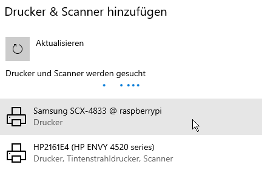

# Raspberry Pi: A print-server with CUPS, AirPrint and Bonjour + IPP

This tutorial describs how to set up as Raspberry Pi as print server for a USB or network printer.
CUPS is used as printserver. Avahi-daemon (Bonjour) is used to make the printer easy to install on Windows devices.

Possible cases:


### 

## Recommendation

Use a static ip for the [raspberry pi](https://diyprojects.io/assign-fixed-ip-address-domain-name-raspberry-pi/#.YaO91NDMKUk) and the printer 

### Install and configure CUPS

First update and upgrade the Advanced Packaging Tool (apt)

```
sudo apt update
sudo apt upgrade
```

Install CUPS

```
sudo apt install cups
```

Allow administration via webbrowser

```
sudo cupsctl --remote-admin
```

Allow printer sharing

```
sudo cupsctl --share-printers
```

Allow printing from any computer in the local network

```
sudo cupsctl --remote-any
```

Add the user 'pi' to the admin-group 'lpadmin'. You also can choose another user if you like.

```
sudo usermod -aG lpadmin pi
```

Restart the CUPS-Server

```
sudo systemctl restart cups
```

### Install Printer Drivers

Depending on the manufacturer and the model there are different driver sources.

For HP-Printers

```
sudo apt install hplip
```

CUPS drivers for Canon, Epson, HP and compatible printers.

```
sudo apt install printer-driver-gutenprint
```

A few Samsung-Printers

```
sudo apt install printer-driver-splix
```

Epson-Printers

```
sudo apt install printer-driver-escpr
```

Restart CUPS-Server

```
sudo systemctl restart cups
```

In my Case for the Samsung SCX-4833FD no driver was availiable via the packages above. But it worked with the PostScript Description from [Printer: Samsung SCX-483x 5x3x | OpenPrinting - The Linux Foundation](https://www.openprinting.org/printer/Samsung/Samsung-SCX-483x_5x3x). There you can directly download the PPD-File.

### Configure CUPS

Open in browser

```
https://raspberrypi:631
```

or find ip-adress

```
ip addr
```

and enter the ip-adress of the raspberry with port 631 in the browser

```
https://192.168.0.168:631
```

Because there is no valid HTTPS-Cerificate you have to accept that in the browser and continue to the site. Click `Advanced` and `Proceed to 192.168.0.XXX (unsafe)`.


Choose

```
Administration / Verwaltung
```

You may get ask to login. By default the user is `pi` and the password is `raspberry`.

```
Add Printer / Drucker hinzufügen
```

#### Add a New Printer (Step 1/5) / Drucker hinzufügen (Schritt 1/5)

Choose the printer you want to add. In my case 'local printer', because of the USB Connection

#### Add a New Printer (Step 3/5) / Drucker hinzufügen (Schritt 3/5)

Give a *name* and *description*. The description is used as name in Windows!

Activate `Share Printer / Freigabe: Drucker im Netzwerk freigeben`

Click `Continue / Weiter`

#### Add a New Printer (Step 5/5) / Drucker hinzufügen (Schritt 5/5)

Choose a Driver in the list or upload a PPD-File. In my case I uploaded the PPD-File.

Click `Add Printer / Drucker hinzufügen`

## Share CUPS Printer via Bonjour/IPP Protocol

> Avahi is a fully LGPL framework for Multicast DNS Service Discovery. It allows programs to publish and discover services and hosts running on a local network with no specific configuration. For example you can plug into a network and instantly find printers to print to, files to look at and people to talk to. (From: [Debian -- Details of package avahi-daemon in sid](https://packages.debian.org/en/sid/avahi-daemon))

Install Avahi-daemon

```
sudo apt install avahi-daemon
```

Start Avahi-daemon

```
sudo systemctl start avahi-daemon
```

Enable autostart

```
sudo systemctl enable avahi-daemon
```

If you use a firewall you may need to open UDP port 5353.

Now you can find the printer in Windows:

EN: Start > Settings > Devices > Printer & scanners > Add a printer or scanner
DE: Start > Einstellungen > Geräte > Drucker & Scanner > Drucker oder Scanner hinzufügen


Here you should see the printer. Click on it and then `Add device / Gerät hinzufügen`


